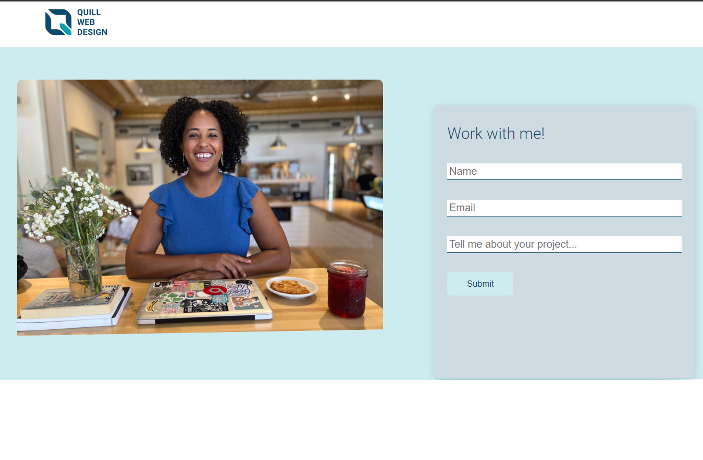

Programmer: Laura Castro
Date: January 2023

## Purpose: 
Quill Web design is responsive website to promote and sell web building services. Continue to review this document to learn about major functions, dependencies, deployment, and contact information.

## Major Functions
- Animation
- Media queries for mobile, tablet, and desktop screens
- Contact form  responsive

## Dependencies
- none

## Build/Deploy Instructions
1. Clone this repository.
2. Install dependencies: `npm install`
3. Start the server: `npm start`
4. Access the app at http://localhost:3000.

## Technologies: 
HTML, CSS, Bootstrap, GitHub

## Contact Information:
For questions or feedback, contact me at quillwebsites@gmail.com

